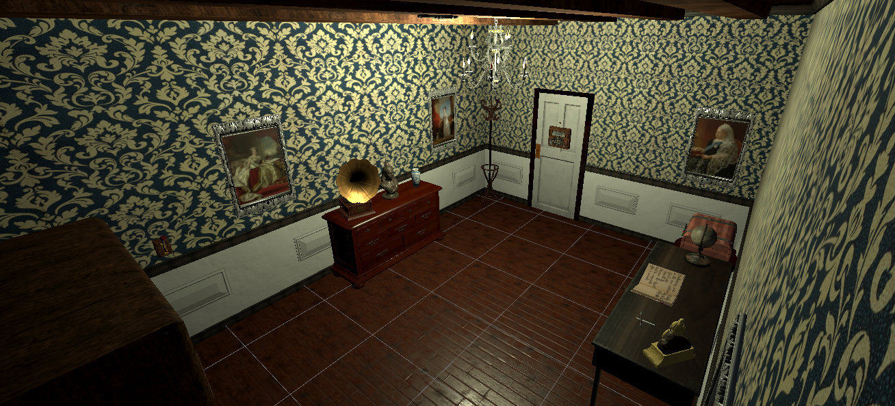
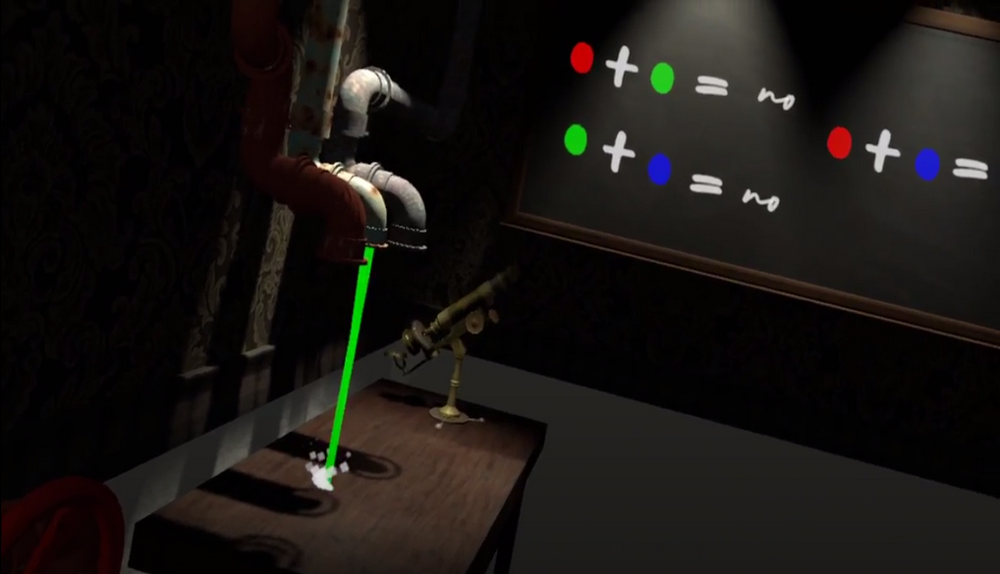

# Enigmatiʞ : an escape game in virtual reality
Enigmatiʞ is an escape game in virtual reality. Dive into an immersive world in a victorian universe on the edge of the steampunk style. You will have to solve many puzzles using your various observation and reflexion skills to find a way out of the room. Good luck !

.

.

## How to play this game ?
This game can be downloaded on [itch.io](https://ywikyx.itch.io/enigmatik "Download the game").

This is a minimum configuration for a smooth playthrough :
+ i5-8300h
+ 8gb of ram
+ Gtx 1050

## Who work on this project ?
+ Cédric DEZOBRY (cedric.dezobry@gmail.com)
+ Donovan TANGUIER ()
+ Clément PELLETIER (clement-pelletier@outlook.com)

This is a student project made during our second years of engineering school.
